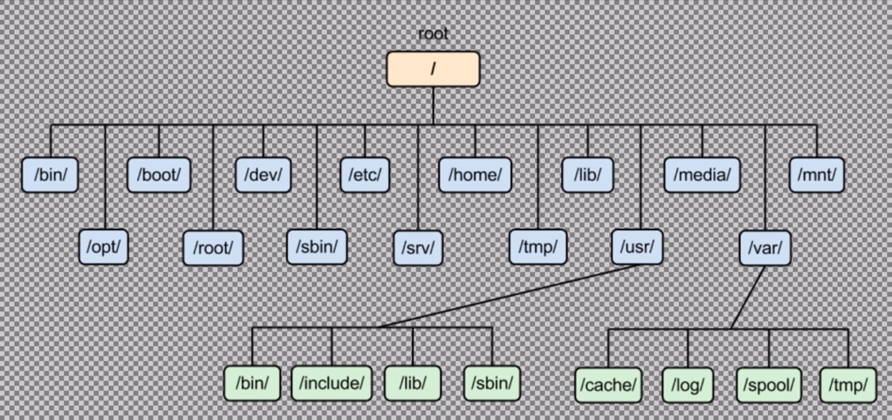

# Bash basics

### Linux file system



### **ls**

**\$** represents that you are a normal user and don't have any special privileges.

**~** represents the home directory

### pwd

```
λ pratham82 [~] → pwd
/home/pratham82
```

```
λ pratham82 [~/Dev] → ls
alacritty-colorscheme   JavaScript-programming  React-framework
```

This command is used to list all the files in the current directories

We can also list specific directories while we are at another path

```
λ pratham82 [~/Dev] → ls ~/Documents
Draft.md  test.py

```

### **Flags with ls:**

**ls -a** lists all directories

```
λ pratham82 [~/Dev] → ls -a
.                      Django-projects         Nodejs-tutorial     React-framework
..                     Git-Testing             Porjects            Shell-scripting
```

**ls -l** this will give a long list

```
λ pratham82 [~/Dev] → ls -l
total 52
drwxrwxr-x  5 pratham82 pratham82 4096 Sep  1 01:37 alacritty-colorscheme
drwxrwxr-x  3 pratham82 pratham82 4096 Jul 10 17:01 C++
drwxrwxr-x  6 pratham82 pratham82 4096 Aug 24 19:17 Django-projects
```

**ls -la** this will give a long list which includes everything also hidden directories

```
λ pratham82 [~/Dev] → ls -la
total 60
drwxrwxr-x 15 pratham82 pratham82 4096 Sep  4 09:58 .
drwxr-xr-x 48 pratham82 pratham82 4096 Sep  4 10:35 ..
drwxrwxr-x  5 pratham82 pratham82 4096 Sep  1 01:37 alacritty-colorscheme
drwxrwxr-x  3 pratham82 pratham82 4096 Jul 10 17:01 C++
drwxrwxr-x  6 pratham82 pratham82 4096 Aug 24 19:17 Django-projects
```

**cd** Change directory

**cd ..** Go up a directory

**cd \~** Go to the home directory

**pushd and poopd:** These commands will keep track of what directory you was in previously, For going from one directory to another directory you have to use **pushd** and directory name, Whens you type **popd** it will take you to the last directory you were in.

```
pratham82 [~] → cd Downloads

λ pratham82 [~/Downloads] → pushd /etc
/etc ~/Downloads ~

λ pratham82 [/etc] → popd
~/Downloads ~

λ pratham82 [~/Downloads] →
```

**file** this command will show the file type

```
λ pratham82 [~] → file .vimrc
.vimrc: ASCII text

λ pratham82 [~] → file .themes
.themes: directory

```
